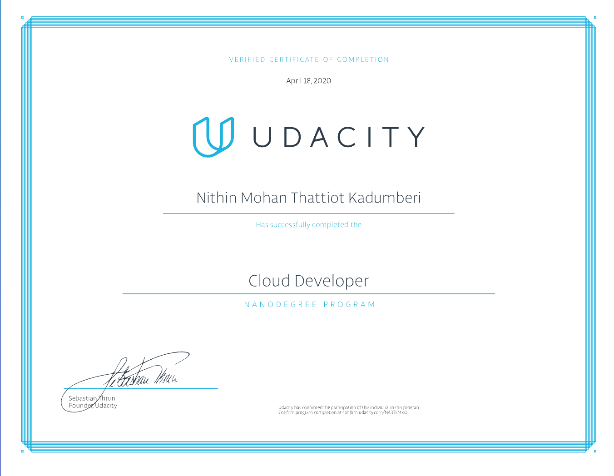

## Introduction 
This repository serves as a comprehensive **DevOps / CloudOps / DevSecOps / SRE Interview Bootcamp** featuring practical projects and real-world examples. Originally created for the **Udacity Cloud Developer Nanodegree program**, it has been transformed into a complete interview preparation resource.

🎯 **Perfect for:** DevOps Engineers, Cloud Engineers, Site Reliability Engineers, Platform Engineers, and Security Engineers preparing for technical interviews.

## 🚀 DevOps Interview Bootcamp

Comprehensive interview preparation covering:
- **Core DevOps**: CI/CD, Version Control, Infrastructure as Code
- **CloudOps**: AWS/Azure/GCP, Container Orchestration, Serverless
- **DevSecOps**: Security in pipelines, Compliance, Vulnerability management
- **SRE**: Monitoring, Incident Response, Performance optimization

**➡️ [Start Interview Preparation](./devops-interview-questions/README.md)**

## Project Status


## Getting Started

### 🎯 For Interview Preparation
**Choose your track:**
- 🛠️ **DevOps Engineer**: Focus on CI/CD, Infrastructure as Code, and automation
- ☁️ **Cloud Engineer**: Emphasize AWS/Azure/GCP services and cloud architecture
- 🔒 **DevSecOps Engineer**: Concentrate on security integration and compliance
- 🔧 **SRE**: Focus on monitoring, reliability, and incident response

**Quick start:** Begin with [DevOps Interview Questions](./devops-interview-questions/README.md)

### 📁 Repository Structure 
### 📚 Interview Preparation Content
* **[devops-interview-questions/](devops-interview-questions/)** - Comprehensive interview questions and scenarios
- - _Core DevOps_ - CI/CD, Git, Configuration Management, IaC
- - _CloudOps_ - AWS/Azure/GCP, Containers, Serverless, Architecture
- - _DevSecOps_ - Security in pipelines, Compliance, Vulnerability scanning
- - _SRE_ - Monitoring, Incident Response, Performance, Reliability
- - _Practical Scenarios_ - Troubleshooting, System Design, Case Studies

### 🏗️ Hands-on Projects (Real-world Examples)
* **exercises** - Sample implementations and lab exercises
- - _udacity-c2-basic-server_ - [exercises/udacity-c2-basic-server](exercises/udacity-c2-basic-server) - Basic server setup and deployment
- - _udacity-c2-restapi_ - [exercises/udacity-c2-frontend](exercises/udacity-c2-frontend) - Frontend development and CI/CD
- - _udacity-c2-frontend_ - [exercises/udacity-c2-restapi](exercises/udacity-c2-restapi) - REST API development
- - _c4-serverless-demos_ - [exercises/c4-demos-master](exercises/c4-demos-master) - Serverless examples
- - _c4-frontend-client_ - [exercises/c4-client-master](exercises/c4-client-master) - Client applications
* **project**  - Production-ready projects demonstrating DevOps practices

**Featured Projects for Interview Preparation:**

- - **🎯 Project 1: Static Site with S3** - [project/staticsite_upload_s3](project/staticsite_upload_s3) - *AWS S3, CloudFront, CI/CD*
- - **🎯 Project 2: Image Filter Microservice** - [project/image-filter-udagram-app](project/image-filter-udagram-app) - *Elastic Beanstalk, Docker, Auto-scaling*
- - **🎯 Project 3: GitHub Profile & Best Practices** - [my-github-profile](https://github.com/nithinmohantk) - *Git workflows, Documentation*
- - **🎯 Project 4: Microservices on Kubernetes** - [project/c2-microservices-v1](project/c2-microservices-v1) - *Kubernetes, Docker, CI/CD, Load Balancing*
- - **🎯 Project 5: Serverless Todo Application** - [project/c4-serverless-app](project/c4-serverless-app) - *AWS Lambda, DynamoDB, API Gateway, Serverless Framework*
- - **🎯 Project 6: LinkedIn Profile Optimization** - [my-linkedin-profile](https://linkedin.com/in/nithinmohantk) - *Professional networking*
- - **🎯 Project 7: Document Management (Capstone)** - [project/p6-docman-app](project/p6-docman-app) - *Full-stack serverless, Security, Authentication*

## 🎨 Key DevOps Technologies Demonstrated

### CI/CD & Automation
- **GitHub Actions** - Automated testing and deployment workflows
- **Travis CI** - Continuous integration pipelines  
- **Docker** - Containerization and image management
- **Kubernetes** - Container orchestration and scaling

### Cloud Services (AWS Focus)
- **EC2, ECS, EKS** - Compute services
- **S3, RDS, DynamoDB** - Storage and databases
- **Lambda, API Gateway** - Serverless architecture
- **CloudFront, Route 53** - CDN and DNS
- **IAM, Secrets Manager** - Security and access control

### Infrastructure & Configuration
- **Infrastructure as Code** - CloudFormation, Terraform concepts
- **Container orchestration** - Kubernetes deployments
- **Load balancing** - NGINX, AWS ALB
- **Monitoring** - CloudWatch, application monitoring

## Installation 
 The samples and projects found in this repository are created using Visual Studio Code and Node.js/NPM/ExpressJS stack and it require certain global NPM components and project NPM components(project.json). 
  I used Windows 10 and 

### Install NodeJS
Install [NodeJS LTS version 10](https://nodejs.org/dist/latest-v10.x/).

- If you are in Windows, you can use the msi installers ([x86](https://nodejs.org/dist/latest-v10.x/node-v10.19.0-x86.msi) or [x64](https://nodejs.org/dist/latest-v10.x/node-v10.19.0-x64.msi)) in this link for the easiest way to set up NodeJS (notice that these direct links evolve over time, so check the latest v10 from the above directory).
- If you have NodeJS already installed, check that you have the correct version by using `node -v`. It should return version 10.19.0.

### Install Visual Studio Code IDE
You can use any code editor or IDE that supports client-side development to build your web part, such as:
- [Visual Studio Code](https://code.visualstudio.com/)  * I used Code
- [Atom](https://atom.io)
- [Webstorm](https://www.jetbrains.com/webstorm)
The steps and examples in this documentation use [Visual Studio Code](https://code.visualstudio.com/), but you can use any editor of your choice.

### Optional Tools
Following are some tools that might come in handy as well:
- [Fiddler](https://www.telerik.com/fiddler)
- [Postman](https://www.getpostman.com/docs/postman/launching_postman/navigating_postman)
- [Windows Terminal](https://github.com/Microsoft/Terminal)
- [Cmder for Windows](http://cmder.net/)
- [Git source control tools](https://git-scm.com/)  ** Essential for cloning the code from **GitHub**

### Setup Python Environment 

```
pip upgrade pip 
````
### Setup AWS CLI
```bash
pip install awscli 
pip install awsebcli
```

### Global NPM Components 
```bash
npm install -g 
```
### Project NPM components
You may require to visit the respective folder after cloning this repository and run :
```bash
npm install 
```

## Usage 
You can use the source code in repository under MIT License without any warranty or support. Free to use, without any royalty.

## Completion Certificate


### License 
MIT License © 2020
