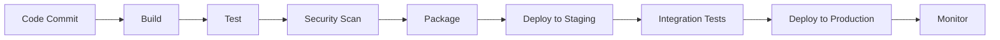

# System Design Questions

## 🟢 Beginner Level Questions

### 1. Design a simple web application architecture
**Question:** Design a basic three-tier web application that can handle 1000 concurrent users.

**Answer:**

**Architecture Components:**
```
[Users] → [Load Balancer] → [Web Servers] → [Database]
                ↓
         [Static Assets CDN]
```

**Detailed Design:**
```yaml
# 3-Tier Architecture
Presentation Tier:
  - Load Balancer (AWS ALB/NGINX)
  - Web Servers (2-3 instances)
  - CDN for static assets (CloudFront)

Application Tier:
  - Application Servers (3-5 instances)
  - Auto Scaling Group
  - Session store (Redis)

Data Tier:
  - Primary Database (RDS/PostgreSQL)
  - Read Replicas (2 instances)
  - Backup and monitoring
```

**Implementation:**
```terraform
# Load Balancer
resource "aws_lb" "main" {
  name               = "main-lb"
  internal           = false
  load_balancer_type = "application"
  subnets            = aws_subnet.public[*].id
  
  enable_deletion_protection = false
}

# Auto Scaling Group
resource "aws_autoscaling_group" "web" {
  name               = "web-asg"
  vpc_zone_identifier = aws_subnet.private[*].id
  min_size           = 2
  max_size           = 10
  desired_capacity   = 3
  
  launch_template {
    id      = aws_launch_template.web.id
    version = "$Latest"
  }
  
  target_group_arns = [aws_lb_target_group.web.arn]
}
```

### 2. How would you design a basic CI/CD pipeline?
**Question:** Design a CI/CD pipeline for a microservices application.

**Answer:**

**Pipeline Stages:**


**Implementation:**
```yaml
# GitHub Actions CI/CD
name: Microservices CI/CD

on:
  push:
    branches: [main]
  pull_request:
    branches: [main]

jobs:
  build-and-test:
    runs-on: ubuntu-latest
    strategy:
      matrix:
        service: [user-service, order-service, payment-service]
    
    steps:
      - uses: actions/checkout@v3
      
      - name: Setup Node.js
        uses: actions/setup-node@v3
        with:
          node-version: '16'
          
      - name: Install dependencies
        run: |
          cd services/${{ matrix.service }}
          npm ci
          
      - name: Run tests
        run: |
          cd services/${{ matrix.service }}
          npm test
          
      - name: Build Docker image
        run: |
          cd services/${{ matrix.service }}
          docker build -t ${{ matrix.service }}:${{ github.sha }} .
          
      - name: Security scan
        uses: aquasecurity/trivy-action@master
        with:
          image-ref: ${{ matrix.service }}:${{ github.sha }}

  deploy-staging:
    needs: build-and-test
    runs-on: ubuntu-latest
    if: github.ref == 'refs/heads/main'
    
    steps:
      - name: Deploy to staging
        run: |
          kubectl set image deployment/${{ matrix.service }} \
            ${{ matrix.service }}=${{ matrix.service }}:${{ github.sha }} \
            -n staging
```

### 3. Design a monitoring system for a web application
**Question:** How would you monitor a web application for performance and availability?

**Answer:**

**Monitoring Stack:**
```
Application → Metrics Collection → Storage → Visualization → Alerting
     ↓              ↓                ↓           ↓            ↓
   Logs →      Prometheus →     Prometheus → Grafana →  AlertManager
  Traces →      Jaeger →        TSDB       → Dashboards →  PagerDuty
```

**Key Metrics to Monitor:**
1. **Application Metrics:**
   - Response time (95th percentile)
   - Request rate
   - Error rate
   - Availability

2. **Infrastructure Metrics:**
   - CPU utilization
   - Memory usage
   - Disk I/O
   - Network traffic

3. **Business Metrics:**
   - User registrations
   - Order completion rate
   - Revenue per hour

**Implementation:**
```yaml
# Prometheus configuration
global:
  scrape_interval: 15s

scrape_configs:
  - job_name: 'web-app'
    static_configs:
      - targets: ['app1:8080', 'app2:8080', 'app3:8080']
    metrics_path: /metrics
    scrape_interval: 5s

  - job_name: 'node-exporter'
    static_configs:
      - targets: ['node1:9100', 'node2:9100']

alerting:
  alertmanagers:
    - static_configs:
        - targets: ['alertmanager:9093']

rule_files:
  - "alert_rules.yml"
```

## 🟡 Intermediate Level Questions

### 4. Design a scalable chat application
**Question:** Design a real-time chat application that can support 1 million concurrent users.

**Answer:**

**Architecture Overview:**
```
[Mobile/Web Clients] → [API Gateway] → [Chat Service] → [Message Queue] → [Database]
                                           ↓
                                    [WebSocket Service]
                                           ↓
                                    [Notification Service]
```

**Detailed Components:**

**1. API Layer:**
```yaml
API Gateway:
  - Rate limiting (1000 requests/minute per user)
  - Authentication and authorization
  - Request routing
  - Load balancing

WebSocket Servers:
  - Maintain persistent connections
  - Handle real-time messaging
  - Connection pooling
  - Horizontal scaling
```

**2. Message Processing:**
```python
# Message service design
class MessageService:
    def __init__(self):
        self.message_queue = KafkaProducer()
        self.user_connections = Redis()
        self.message_store = Cassandra()
    
    async def send_message(self, message):
        # Store message
        await self.message_store.insert(message)
        
        # Queue for delivery
        await self.message_queue.produce(
            topic=f"chat-{message.chat_id}",
            value=message.to_json()
        )
        
        # Real-time delivery
        await self.deliver_real_time(message)
    
    async def deliver_real_time(self, message):
        # Get online users in chat
        online_users = await self.user_connections.get_chat_users(
            message.chat_id
        )
        
        # Send via WebSocket
        for user_id in online_users:
            await self.send_websocket_message(user_id, message)
```

**3. Data Storage:**
```yaml
# Database design
Users:
  user_id: UUID (Primary Key)
  username: String
  email: String
  created_at: Timestamp

Chats:
  chat_id: UUID (Primary Key)
  chat_type: Enum (direct, group)
  created_at: Timestamp
  updated_at: Timestamp

Messages:
  message_id: UUID (Primary Key)
  chat_id: UUID (Foreign Key)
  user_id: UUID (Foreign Key)
  content: Text
  message_type: Enum (text, image, file)
  created_at: Timestamp
  
# Partitioning strategy
# Partition messages by chat_id and timestamp
# Use Cassandra or MongoDB for horizontal scaling
```

**4. Scaling Strategy:**
```yaml
Horizontal Scaling:
  WebSocket Servers:
    - Multiple server instances
    - Load balancer with sticky sessions
    - Connection state in Redis
    
  Message Processing:
    - Kafka for message queuing
    - Multiple consumer instances
    - Partitioning by chat_id
    
  Database:
    - Read replicas for message history
    - Sharding by user_id or chat_id
    - Caching frequently accessed data
```

### 5. Design a URL shortener service like bit.ly
**Question:** Design a URL shortening service that can handle 100M URLs per day.

**Answer:**

**Requirements Analysis:**
```yaml
Functional Requirements:
  - Shorten long URLs
  - Redirect short URLs to original
  - Custom aliases (optional)
  - URL expiration
  - Analytics

Non-functional Requirements:
  - 100M URLs per day (~1160 URLs/second)
  - 100:1 read-to-write ratio
  - 99.9% availability
  - Low latency (<100ms)

Capacity Estimation:
  - Write: 1160 URLs/second
  - Read: 116,000 redirects/second
  - Storage: 100M URLs * 365 days * 5 years = 182.5B URLs
  - Storage size: 182.5B * 500 bytes = ~91TB over 5 years
```

**System Architecture:**
```
[Client] → [Load Balancer] → [Web Servers] → [Cache] → [Database]
              ↓                                         ↓
         [Analytics Service] ← [Message Queue] ← [URL Service]
              ↓
         [Analytics DB]
```

**Core Algorithm:**
```python
# URL encoding service
import hashlib
import base62

class URLShortener:
    def __init__(self):
        self.base_url = "https://short.ly/"
        self.counter = 0
        
    def encode_url(self, long_url, custom_alias=None):
        if custom_alias:
            short_code = custom_alias
        else:
            # Generate unique short code
            short_code = self.generate_short_code(long_url)
        
        # Store in database
        url_mapping = {
            'short_code': short_code,
            'long_url': long_url,
            'created_at': datetime.utcnow(),
            'expires_at': datetime.utcnow() + timedelta(years=1)
        }
        
        self.save_url_mapping(url_mapping)
        
        return f"{self.base_url}{short_code}"
    
    def generate_short_code(self, long_url):
        # Method 1: Hash-based
        hash_value = hashlib.md5(long_url.encode()).hexdigest()
        return base62.encode(int(hash_value[:8], 16))
        
        # Method 2: Counter-based (with distributed counter)
        # self.counter += 1
        # return base62.encode(self.counter)
    
    def decode_url(self, short_code):
        # Check cache first
        cached_url = self.cache.get(short_code)
        if cached_url:
            self.record_analytics(short_code)
            return cached_url
            
        # Get from database
        url_mapping = self.get_url_mapping(short_code)
        if url_mapping and not self.is_expired(url_mapping):
            # Cache for future requests
            self.cache.set(short_code, url_mapping['long_url'], ttl=3600)
            self.record_analytics(short_code)
            return url_mapping['long_url']
            
        return None
```

**Database Schema:**
```sql
-- Main URL mapping table
CREATE TABLE url_mappings (
    short_code VARCHAR(7) PRIMARY KEY,
    long_url TEXT NOT NULL,
    user_id UUID,
    created_at TIMESTAMP DEFAULT NOW(),
    expires_at TIMESTAMP,
    click_count INTEGER DEFAULT 0,
    is_active BOOLEAN DEFAULT TRUE
);

-- Analytics table (separate for performance)
CREATE TABLE url_analytics (
    id SERIAL PRIMARY KEY,
    short_code VARCHAR(7),
    ip_address INET,
    user_agent TEXT,
    referer TEXT,
    country VARCHAR(2),
    clicked_at TIMESTAMP DEFAULT NOW()
);

-- Indexes for performance
CREATE INDEX idx_url_mappings_user_id ON url_mappings(user_id);
CREATE INDEX idx_url_analytics_short_code ON url_analytics(short_code);
CREATE INDEX idx_url_analytics_clicked_at ON url_analytics(clicked_at);
```

**Caching Strategy:**
```yaml
Cache Layers:
  Browser Cache:
    - Cache redirects with 301/302 status
    - TTL: 1 hour for temporary URLs, 1 day for permanent
    
  CDN Cache:
    - Cache popular short URLs globally
    - TTL: 1 hour
    - Invalidate on URL update/deletion
    
  Application Cache (Redis):
    - Cache URL mappings
    - TTL: 1 hour
    - LRU eviction policy
    - Separate cache for analytics
```

### 6. Design a distributed file storage system
**Question:** Design a distributed file storage system like Dropbox.

**Answer:**

**System Components:**
```
[Client Apps] → [API Gateway] → [File Service] → [Metadata DB]
      ↓              ↓              ↓               ↓
  [Sync Client] → [Load Balancer] → [Block Storage] → [File Storage]
      ↓                              ↓
  [Local Storage] ← [CDN] ← [Replication Service]
```

**File Upload Process:**
```python
# File upload service
class FileUploadService:
    def __init__(self):
        self.block_size = 4 * 1024 * 1024  # 4MB blocks
        self.metadata_db = MetadataDatabase()
        self.block_storage = BlockStorage()
        self.replication_service = ReplicationService()
    
    async def upload_file(self, file_path, file_content):
        # 1. Calculate file hash for deduplication
        file_hash = hashlib.sha256(file_content).hexdigest()
        
        # 2. Check if file already exists
        existing_file = await self.metadata_db.get_file_by_hash(file_hash)
        if existing_file:
            return await self.create_file_reference(file_path, existing_file)
        
        # 3. Split file into blocks
        blocks = self.split_into_blocks(file_content)
        
        # 4. Upload blocks in parallel
        block_ids = await asyncio.gather(*[
            self.upload_block(block) for block in blocks
        ])
        
        # 5. Store metadata
        file_metadata = {
            'file_path': file_path,
            'file_hash': file_hash,
            'size': len(file_content),
            'block_ids': block_ids,
            'created_at': datetime.utcnow(),
            'version': 1
        }
        
        file_id = await self.metadata_db.create_file(file_metadata)
        
        # 6. Trigger replication
        await self.replication_service.replicate_file(file_id)
        
        return file_id
    
    def split_into_blocks(self, content):
        """Split file content into fixed-size blocks"""
        blocks = []
        for i in range(0, len(content), self.block_size):
            block = content[i:i + self.block_size]
            block_hash = hashlib.sha256(block).hexdigest()
            blocks.append({
                'content': block,
                'hash': block_hash,
                'size': len(block)
            })
        return blocks
    
    async def upload_block(self, block):
        # Check if block already exists (deduplication)
        existing_block = await self.block_storage.get_block(block['hash'])
        if existing_block:
            return block['hash']
        
        # Upload new block
        await self.block_storage.store_block(block['hash'], block['content'])
        return block['hash']
```

**Synchronization Algorithm:**
```python
# File synchronization service
class FileSyncService:
    def __init__(self):
        self.metadata_db = MetadataDatabase()
        self.conflict_resolver = ConflictResolver()
    
    async def sync_changes(self, user_id, device_id):
        # 1. Get last sync timestamp for device
        last_sync = await self.get_last_sync_time(user_id, device_id)
        
        # 2. Get server changes since last sync
        server_changes = await self.metadata_db.get_changes_since(
            user_id, last_sync
        )
        
        # 3. Get client changes
        client_changes = await self.get_client_changes(device_id)
        
        # 4. Detect and resolve conflicts
        conflicts = self.detect_conflicts(server_changes, client_changes)
        resolved_changes = await self.conflict_resolver.resolve(conflicts)
        
        # 5. Apply changes
        await self.apply_server_changes(device_id, server_changes)
        await self.apply_client_changes(user_id, resolved_changes)
        
        # 6. Update sync timestamp
        await self.update_sync_time(user_id, device_id, datetime.utcnow())
        
        return {
            'server_changes': len(server_changes),
            'client_changes': len(resolved_changes),
            'conflicts_resolved': len(conflicts)
        }
    
    def detect_conflicts(self, server_changes, client_changes):
        """Detect conflicts between server and client changes"""
        conflicts = []
        
        for server_change in server_changes:
            for client_change in client_changes:
                if (server_change['file_path'] == client_change['file_path'] and
                    server_change['timestamp'] > client_change['base_timestamp']):
                    conflicts.append({
                        'file_path': server_change['file_path'],
                        'server_change': server_change,
                        'client_change': client_change,
                        'type': 'modification_conflict'
                    })
        
        return conflicts
```

**Data Storage Strategy:**
```yaml
Metadata Storage (PostgreSQL):
  Tables:
    - users
    - files
    - file_versions
    - file_blocks
    - sharing_permissions
    - sync_history
  
  Sharding Strategy:
    - Shard by user_id
    - Each shard handles 1M users
    
Block Storage:
  Primary Storage:
    - Amazon S3 or similar object storage
    - Erasure coding for redundancy
    - Geographic distribution
    
  Caching:
    - CDN for frequently accessed files
    - Local cache on client devices
    - Redis for hot metadata
    
  Replication:
    - 3 replicas minimum
    - Cross-region replication
    - Eventual consistency
```

## 🔴 Advanced Level Questions

### 7. Design a global content delivery network (CDN)
**Question:** Design a CDN that can serve content globally with low latency.

**Answer:**

**CDN Architecture:**
```
[Content Publishers] → [Origin Servers] → [CDN Edge Servers] → [End Users]
         ↓                    ↓                ↓
    [Management API] → [Cache Management] → [Geographic Distribution]
         ↓                    ↓                ↓
    [Analytics] ← [Log Collection] ← [Performance Monitoring]
```

**Edge Server Design:**
```python
# CDN Edge Server implementation
class CDNEdgeServer:
    def __init__(self, location, capacity):
        self.location = location
        self.capacity = capacity
        self.cache = LRUCache(capacity)
        self.origin_servers = OriginServerPool()
        self.health_checker = HealthChecker()
        
    async def serve_request(self, request):
        cache_key = self.generate_cache_key(request)
        
        # 1. Check local cache
        cached_content = self.cache.get(cache_key)
        if cached_content and not self.is_expired(cached_content):
            self.record_cache_hit(request)
            return cached_content
        
        # 2. Check other edge servers in region
        regional_content = await self.check_regional_cache(cache_key)
        if regional_content:
            self.cache.set(cache_key, regional_content)
            return regional_content
        
        # 3. Fetch from origin server
        origin_content = await self.fetch_from_origin(request)
        
        # 4. Cache the content
        self.cache.set(cache_key, origin_content, ttl=request.cache_ttl)
        
        # 5. Pre-warm related content
        await self.pre_warm_content(request)
        
        return origin_content
    
    async def fetch_from_origin(self, request):
        # Select best origin server
        origin_server = await self.origin_servers.select_best_server(
            criteria=['latency', 'load', 'health']
        )
        
        # Fetch with retry and circuit breaker
        try:
            content = await origin_server.fetch(request.url)
            self.record_origin_hit(request, origin_server)
            return content
        except Exception as e:
            # Fallback to backup origin
            backup_server = await self.origin_servers.get_backup_server()
            return await backup_server.fetch(request.url)
```

**Global Load Balancing:**
```python
# Global Traffic Manager
class GlobalTrafficManager:
    def __init__(self):
        self.edge_servers = EdgeServerManager()
        self.geo_locator = GeoLocationService()
        self.performance_monitor = PerformanceMonitor()
        
    async def route_request(self, user_request):
        # 1. Determine user location
        user_location = await self.geo_locator.get_location(
            user_request.ip_address
        )
        
        # 2. Get candidate edge servers
        candidate_servers = await self.edge_servers.get_servers_near(
            user_location, radius=500  # 500km radius
        )
        
        # 3. Select best server based on multiple factors
        best_server = await self.select_optimal_server(
            candidate_servers, user_request
        )
        
        return best_server
    
    async def select_optimal_server(self, servers, request):
        scores = {}
        
        for server in servers:
            # Calculate composite score
            latency_score = await self.calculate_latency_score(server, request)
            load_score = await self.calculate_load_score(server)
            health_score = await self.calculate_health_score(server)
            cache_score = await self.calculate_cache_score(server, request)
            
            scores[server] = (
                latency_score * 0.4 +
                load_score * 0.2 +
                health_score * 0.2 +
                cache_score * 0.2
            )
        
        return max(scores, key=scores.get)
```

**Content Distribution Strategy:**
```yaml
Cache Hierarchy:
  L1 Cache (Edge Servers):
    - Size: 10TB per server
    - Strategy: LRU with content popularity
    - TTL: Based on content type and freshness
    
  L2 Cache (Regional Servers):
    - Size: 100TB per region
    - Strategy: Popular content pre-loading
    - Serves multiple edge servers
    
  Origin Servers:
    - Geographic distribution
    - Load balancing
    - Backup and failover

Cache Warming Strategy:
  Popular Content:
    - Pre-load trending content
    - Use ML to predict popularity
    - Time-based pre-loading
    
  User Behavior:
    - Analyze user patterns
    - Pre-load likely next requests
    - Geographic popularity trends
```

### 8. Design a real-time fraud detection system
**Question:** Design a system to detect fraudulent transactions in real-time.

**Answer:**

**System Architecture:**
```
[Transaction Stream] → [Real-time Processing] → [ML Models] → [Decision Engine]
        ↓                      ↓                    ↓             ↓
   [Data Pipeline] → [Feature Engineering] → [Model Serving] → [Actions]
        ↓                      ↓                    ↓             ↓
   [Batch Processing] → [Model Training] → [Model Store] → [Notifications]
```

**Real-time Processing Pipeline:**
```python
# Fraud detection service
from kafka import KafkaConsumer, KafkaProducer
import asyncio
from sklearn.ensemble import IsolationForest
import redis

class FraudDetectionService:
    def __init__(self):
        self.consumer = KafkaConsumer('transactions')
        self.producer = KafkaProducer('fraud-alerts')
        self.feature_store = redis.Redis()
        self.ml_models = ModelStore()
        self.rules_engine = RulesEngine()
        
    async def process_transaction(self, transaction):
        # 1. Extract features in real-time
        features = await self.extract_features(transaction)
        
        # 2. Apply rule-based checks (fast path)
        rule_result = self.rules_engine.evaluate(transaction, features)
        if rule_result.high_risk:
            return await self.block_transaction(transaction, 'rule_violation')
        
        # 3. Apply ML models
        ml_scores = await self.get_ml_scores(features)
        
        # 4. Combine scores and make decision
        final_score = self.combine_scores(rule_result, ml_scores)
        
        # 5. Take action based on score
        if final_score > 0.9:
            return await self.block_transaction(transaction, 'high_risk')
        elif final_score > 0.7:
            return await self.challenge_transaction(transaction)
        else:
            return await self.approve_transaction(transaction)
    
    async def extract_features(self, transaction):
        """Extract features for fraud detection"""
        user_id = transaction['user_id']
        
        # Historical features (from cache/database)
        user_history = await self.get_user_history(user_id)
        
        features = {
            # Transaction features
            'amount': transaction['amount'],
            'merchant_id': transaction['merchant_id'],
            'transaction_time': transaction['timestamp'],
            'location': transaction['location'],
            
            # User behavior features
            'avg_transaction_amount': user_history.avg_amount,
            'transactions_last_hour': user_history.recent_count,
            'usual_merchants': user_history.frequent_merchants,
            'usual_locations': user_history.frequent_locations,
            
            # Derived features
            'amount_deviation': abs(transaction['amount'] - user_history.avg_amount),
            'time_since_last_transaction': self.time_since_last(user_id),
            'distance_from_usual_location': self.calculate_distance(
                transaction['location'], user_history.usual_location
            ),
            
            # Real-time aggregations
            'merchant_velocity': await self.get_merchant_velocity(
                transaction['merchant_id']
            ),
            'location_risk_score': await self.get_location_risk(
                transaction['location']
            )
        }
        
        return features
    
    async def get_ml_scores(self, features):
        """Get scores from multiple ML models"""
        # Model ensemble for better accuracy
        models = [
            'gradient_boosting_model',
            'neural_network_model', 
            'isolation_forest_model',
            'autoencoder_model'
        ]
        
        scores = {}
        for model_name in models:
            model = await self.ml_models.get_model(model_name)
            score = await model.predict(features)
            scores[model_name] = score
            
        return scores
```

**Feature Engineering Pipeline:**
```python
# Real-time feature engineering
class FeatureEngineer:
    def __init__(self):
        self.feature_store = FeatureStore()
        self.stream_processor = StreamProcessor()
        
    async def compute_real_time_features(self, transaction):
        user_id = transaction['user_id']
        
        # Time-based aggregations
        features = {
            'transactions_last_1h': await self.count_transactions(
                user_id, timedelta(hours=1)
            ),
            'transactions_last_24h': await self.count_transactions(
                user_id, timedelta(hours=24)
            ),
            'amount_last_1h': await self.sum_amounts(
                user_id, timedelta(hours=1)
            ),
            
            # Velocity features
            'unique_merchants_1h': await self.count_unique_merchants(
                user_id, timedelta(hours=1)
            ),
            'unique_locations_1h': await self.count_unique_locations(
                user_id, timedelta(hours=1)
            ),
            
            # Behavioral anomalies
            'night_transaction': self.is_night_time(transaction['timestamp']),
            'weekend_transaction': self.is_weekend(transaction['timestamp']),
            'new_merchant': await self.is_new_merchant(user_id, transaction['merchant_id']),
            'new_location': await self.is_new_location(user_id, transaction['location'])
        }
        
        return features
    
    async def update_user_profile(self, user_id, transaction):
        """Update user profile with new transaction"""
        profile_updates = {
            'last_transaction_time': transaction['timestamp'],
            'total_transactions': 'increment',
            'total_amount': transaction['amount'],
            'merchants': transaction['merchant_id'],
            'locations': transaction['location']
        }
        
        await self.feature_store.update_profile(user_id, profile_updates)
```

**Model Training and Deployment:**
```python
# ML model management
class ModelManager:
    def __init__(self):
        self.model_store = ModelStore()
        self.training_pipeline = TrainingPipeline()
        self.deployment_manager = DeploymentManager()
        
    async def train_models(self):
        """Periodic model retraining"""
        # 1. Get labeled training data
        training_data = await self.get_training_data()
        
        # 2. Train multiple models
        models = {
            'gradient_boosting': self.train_gb_model(training_data),
            'neural_network': self.train_nn_model(training_data),
            'isolation_forest': self.train_isolation_forest(training_data)
        }
        
        # 3. Evaluate models
        for name, model in models.items():
            performance = await self.evaluate_model(model, training_data)
            await self.log_model_performance(name, performance)
        
        # 4. Deploy best performing models
        await self.deploy_models(models)
    
    def train_gb_model(self, training_data):
        """Train gradient boosting model"""
        from xgboost import XGBClassifier
        
        model = XGBClassifier(
            n_estimators=100,
            max_depth=6,
            learning_rate=0.1,
            subsample=0.8,
            colsample_bytree=0.8
        )
        
        X_train, y_train = training_data.features, training_data.labels
        model.fit(X_train, y_train)
        
        return model
```

**Decision Engine:**
```python
# Fraud decision engine
class FraudDecisionEngine:
    def __init__(self):
        self.risk_thresholds = {
            'block': 0.9,
            'challenge': 0.7,
            'monitor': 0.5,
            'approve': 0.0
        }
        self.action_executor = ActionExecutor()
        
    async def make_decision(self, transaction, risk_score, model_explanations):
        """Make final decision on transaction"""
        
        if risk_score >= self.risk_thresholds['block']:
            action = 'block'
            reason = 'High fraud risk detected'
        elif risk_score >= self.risk_thresholds['challenge']:
            action = 'challenge'
            reason = 'Additional authentication required'
        elif risk_score >= self.risk_thresholds['monitor']:
            action = 'approve_with_monitoring'
            reason = 'Approved but flagged for monitoring'
        else:
            action = 'approve'
            reason = 'Low risk transaction'
        
        # Execute the action
        result = await self.action_executor.execute(
            action, transaction, risk_score, reason
        )
        
        # Log for audit and model improvement
        await self.log_decision(transaction, risk_score, action, result)
        
        return result
```

**Performance Requirements:**
```yaml
Latency Requirements:
  - 95th percentile: <50ms
  - 99th percentile: <100ms
  - Timeout: 200ms (fallback to rules)

Throughput:
  - 100,000 transactions/second
  - Peak: 500,000 transactions/second

Accuracy:
  - False positive rate: <1%
  - False negative rate: <0.1%
  - Model refresh: Every 24 hours

Availability:
  - 99.99% uptime
  - Graceful degradation to rules-only mode
  - Multi-region deployment
```

## 🛠️ System Design Principles

### Scalability Patterns
```yaml
Horizontal Scaling:
  - Stateless services
  - Load balancing
  - Auto-scaling
  - Database sharding

Vertical Scaling:
  - Resource optimization
  - Caching strategies
  - Connection pooling
  - Query optimization

Caching Strategies:
  - Browser caching
  - CDN caching
  - Application caching
  - Database caching
```

### Reliability Patterns
```yaml
Fault Tolerance:
  - Circuit breakers
  - Retry mechanisms
  - Timeout handling
  - Graceful degradation

High Availability:
  - Redundancy
  - Failover mechanisms
  - Health checks
  - Load distribution

Disaster Recovery:
  - Backup strategies
  - Cross-region replication
  - Recovery procedures
  - Business continuity
```

## 🔗 Real-world Examples

System design implementations in this repository:
- [Microservices Architecture](../../project/c2-microservices-v1/)
- [Serverless System Design](../../project/c4-serverless-app/)
- [Scalable Document Management](../../project/p6-docman-app/)

## 📚 Additional Resources

- [High Scalability](http://highscalability.com/)
- [System Design Primer](https://github.com/donnemartin/system-design-primer)
- [AWS Well-Architected Framework](https://aws.amazon.com/architecture/well-architected/)
- [Google SRE Books](https://sre.google/books/)