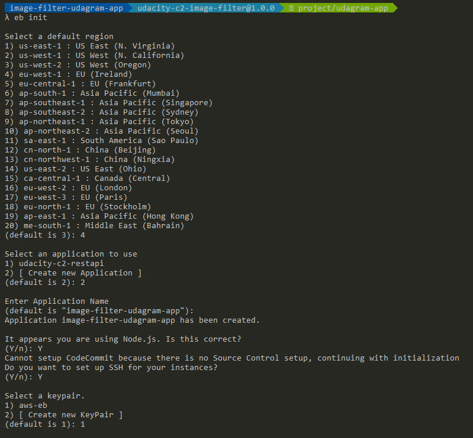
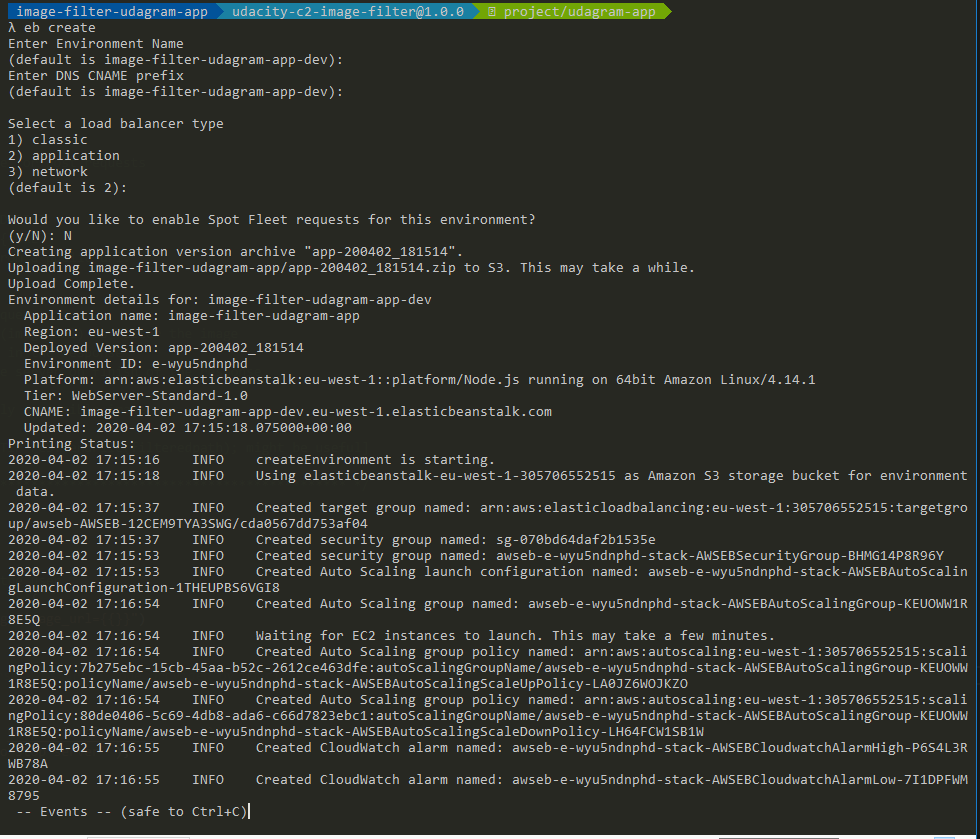
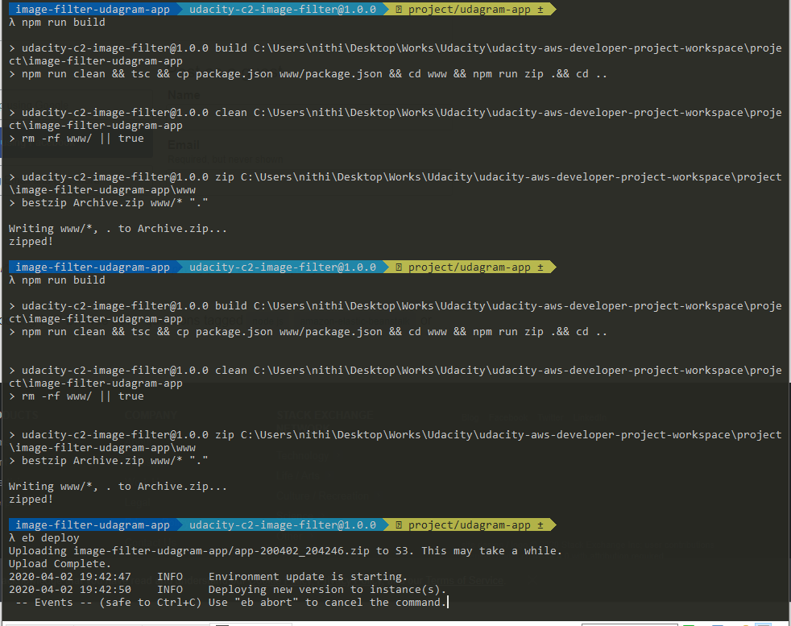
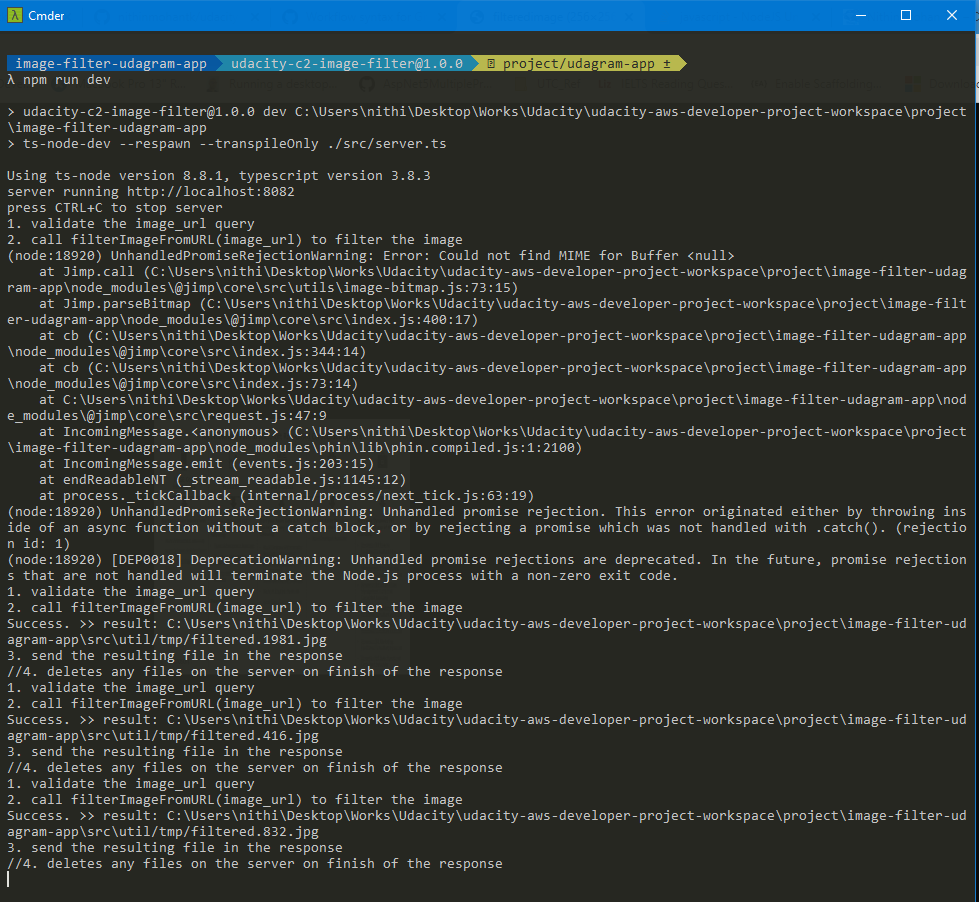
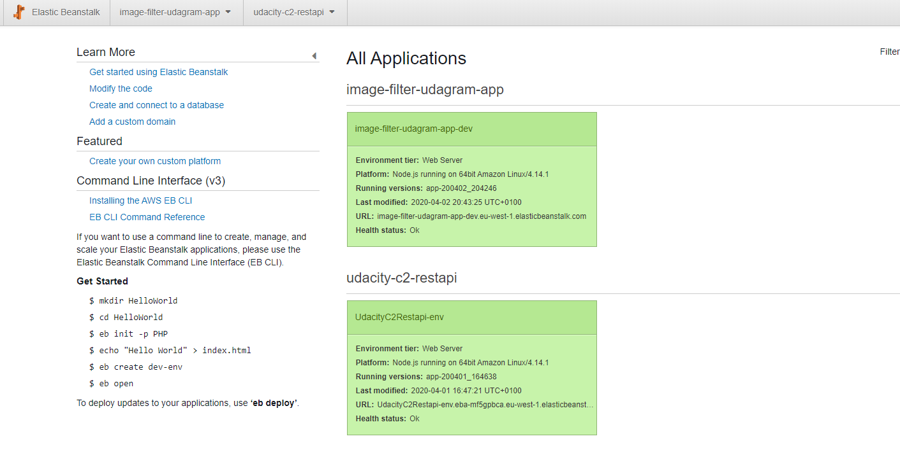
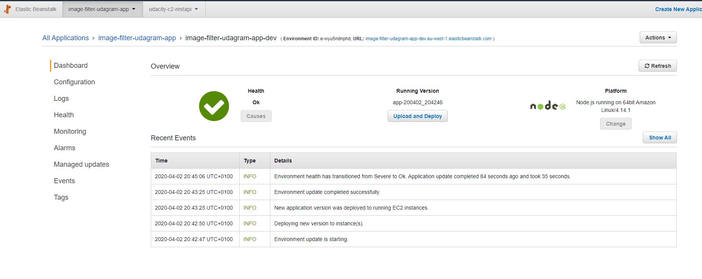
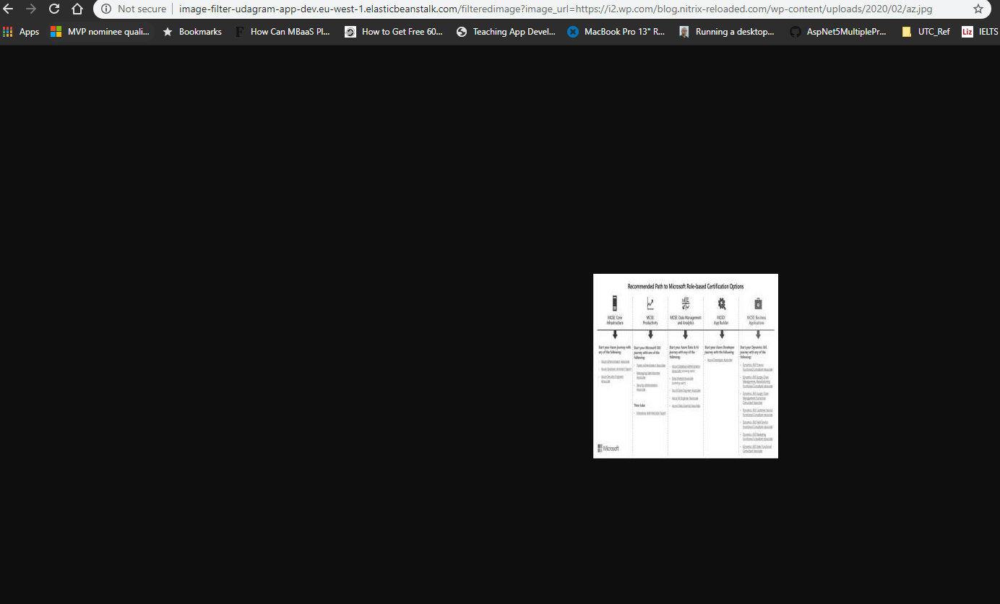
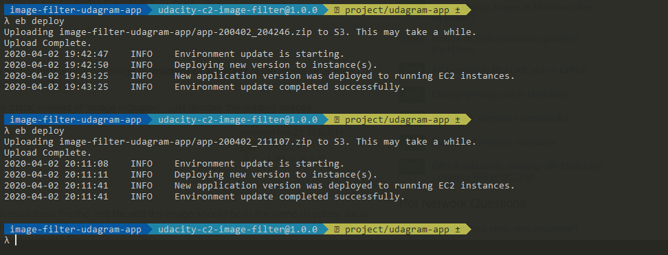
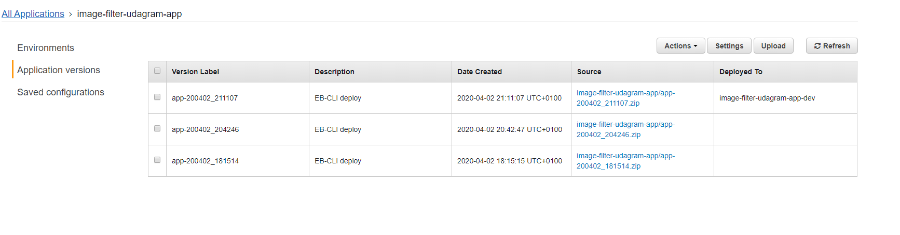

### Intro

This folder contains all necessary screenshots of the deployed udagram project.  


### Changes 

1. **Used 'bestzip' npm component**: for creating archive.zip 
In Windows build command to create archive.zip will not work, as there is no 'zip' exec by default in windows.
2. src\tmp\dummy.ts - temporary workaround  to make the "tmp" folder copied to www folder, as npm build was failing due to lack of permission to execute 'mkdir www/tmp', as my working folder was in Windows Desktop, and lacks permission.
3. **package.json** - modified npm commands to fit the needs. 
4. **npm audit fix** && **package-lock.json** - to fix issues.
5. **server.ts**  - implemented the following code and added console logging 

```javascript
app.get('/filteredimage', 
    async ( req, res ) => { 
    let { image_url } = req.query;

    console.log("1. validate the image_url query");
    if (!image_url) {
      return res.status(400).send("Invalid request. image_url is required");
    }
  
    console.log("2. call filterImageFromURL(image_url) to filter the image");
    const filterResult = await filterImageFromURL(image_url)
    .then((filterResult) => {

      if(filterResult)
      {
        console.log("Success. >> result: " + filterResult);
      }
      console.log("3. send the resulting file in the response");
      //3. send the resulting file in the response
      res.sendFile(filterResult, function(){
        console.log("4. deletes any files on the server on finish of the response");
        //4. deletes any files on the server on finish of the response
        deleteLocalFiles([filterResult]);
      });
    })
    .catch(error => { console.log('Error caught', error.message); }); ;

  });

  ```

### Local Sample URL

```console
http://localhost:8082/filteredimage?image_url=http://thingx.cloud/wp-content/uploads/2020/02/image-2.png
http://localhost:8082/filteredimage?image_url=https://i2.wp.com/blog.nitrix-reloaded.com/wp-content/uploads/2020/02/az.jpg
http://localhost:8082/filteredimage?image_url=https://wallpaperaccess.com/full/560420.jpg
```

### Elastic Benstalk URL (Hosted)

```console
http://image-filter-udagram-app-dev.eu-west-1.elasticbeanstalk.com/filteredimage?image_url=https://i2.wp.com/blog.nitrix-reloaded.com/wp-content/uploads/2020/02/az.jpg
http://image-filter-udagram-app-dev.eu-west-1.elasticbeanstalk.com/filteredimage?image_url=https://wallpaperaccess.com/full/560420.jpg
```

### Screenshots 









